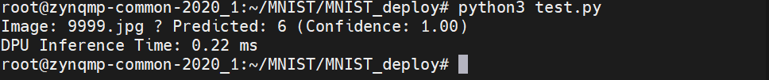

## Model Deployment on AXU2CGB
This README section provides instructions for deploying the compiled MNIST model on the **AXU2CGB UltraScale+ FPGA board** after the boot image has been loaded successfully.
###  Prerequisites

- The board has already been booted with the correct Petalinux image.
- The compiled required `.so` files are available.
- You have network or USB access to copy files to the board.

### Step 1: Copy Deployment Files to the Board

This required : 
- `MNIST_JPG_testing`
- `model_data`
- `modellib`
- `libdpumodeldeploy.so`
- `test.py`
- `vitis-ai_v1.2_dnndk.tar.gz`

### Step 2: Install DNNDK v1.2
After extract the `vitis-ai_v1.2_dnndk.tar.gz`, install:
```bash
./install.sh
```

### Step 3: Run python code
Once the dnndk installed finish, then run:
```bash
pyhton3 test.py
```
After that result will shown: 



The above image shows the result of running the MNIST model using `test.py` on the AXU2CGB board.