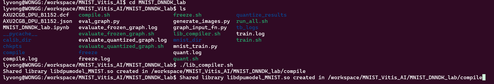

## MNIST Model Creation

This README file explains how to train and export an MNIST model for deployment on the **AXU2CGB UltraScale+ Board** using Vitis AI.

---

### Step 1: Activate Conda TensorFlow Environment

Make sure you are using the correct Vitis AI TensorFlow environment:

```bash
conda activate vitis-ai-tensorflow
```
### Step 2: Train and Export the Model

In this step, you will run a script that automates the entire Vitis AI model preparation workflow for MNIST. This includes training, freezing, quantizing, and compiling the model.

#### Script: `run_all.sh`

This script performs the following steps:

1. **Clean Logs**  
   Deletes all `.log` files from previous runs.

2. **Train the Model**  
   Executes `train.sh` and saves the log to `train.log`.

3. **Freeze the Graph**  
   Converts the trained model into a frozen graph and logs to `freeze.log`.

4. **Evaluate Frozen Graph**  
   Tests the frozen model’s accuracy and logs to `evaluate_frozen_graph.log`.

5. **Quantize the Model**  
   Optimizes the model for deployment and logs to `quant.log`.

6. **Evaluate Quantized Model**  
   Tests the quantized model and logs to `evaluate_quantized_graph.log`.

7. **Compile the Model**  
   Compiles the quantized model using the Vitis AI compiler and logs to `compile.log`.

#### How to Run

Make the script executable and run it:

```bash
chmod +x run_all.sh
./run_all.sh
```
### Step 3: Run `lib_compiler.sh`

After the model has been compiled using `run_all.sh`, the next step is to run `lib_compiler.sh` in order to create a .so file. This script prepares the compiled model for deployment on the target hardware. Frist you need to exit from Tensorflow environment, and then go run:
```bash
chmod +x runtime-docker.sh
./runtime-docker.sh
```
Then run:
```bash
chmod +x lib_compiler.sh
./lib_compiler.sh
```
After that you will get: 
```bash
Shared library libdpumodel_MNIST.so created in /workspace/MNIST_Vitis_AI/MNIST_DNNDK_lab/compile
```
Like this results:

