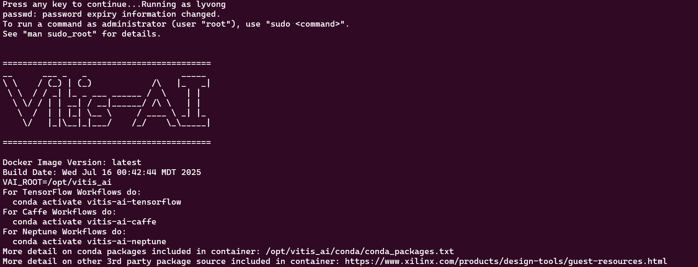

# Vitis AI Version 1.2.4 Set Up

This README file contains step-by-step instructions for installing Vitis AI version 1.2.4. This guideline will use Ubuntu 22.04.5.

### Step 1: Remove Old Docker Versions

Run the following command to remove any old versions of Docker that might be installed:

```bash
sudo apt-get remove docker docker-engine docker-ce docker.io
``` 
### Step 2: Install curl

Make sure `curl` is installed. You can install it by running:

```bash
sudo apt-get install curl
```
### Step 3: Add Docker’s Official GPG Key

Run the following command to add Docker’s GPG key:

```bash
curl -fsSL https://download.docker.com/linux/ubuntu/gpg | sudo apt-key add -
```
After run this, you will see "OK"
### Step 4: Install Docker CE and Related Tools

Update your package list and install Docker CE, Docker CLI, and containerd by running:

```bash
sudo apt-get update && sudo apt install docker-ce docker-ce-cli containerd.io
```
### Step 5: Verify Docker Installation

After installing Docker, run the following command to check the installed version:

```bash
sudo docker --version
```
### Step 6: Test Docker with a Hello World Container

To verify that Docker is working correctly, run the following test container:

```bash
sudo docker run hello-world
```
If Docker is installed and running properly, you will see a message starting with:
```bash
Hello from Docker!
This message shows that your installation appears to be working correctly.
```
### Step 7: Install and Run Xilinx Vitis-AI Docker

First, download the `Vitis-AI-master.tar.gz` file and extract it. Then, give execution permission and run the Docker setup script:

```bash
chmod +x dpu-compiler-docker-install.sh
./dpu-compiler-docker-install.sh
```
Then 
```bash
chmod +x dpu-compiler-docker.sh
./dpu-compiler-docker.sh
```
After that you will see: 




